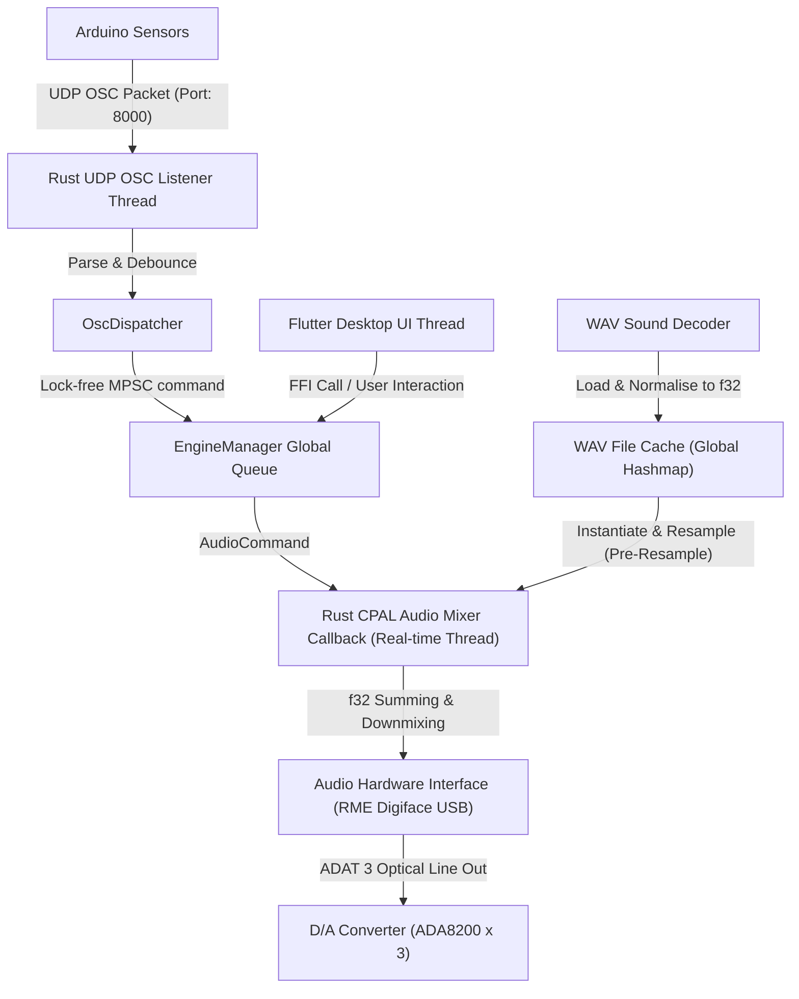

# 2. TRD (Technical Requirements Document - 기술 요구사항 정의서)

## 1. 하드웨어 타겟 및 OS 환경
*   **운영체제**: macOS 12+ (Core Audio), Windows 10/11 (ASIO 드라이버).
*   **권한 설정 (macOS 버그 수정)**: '오디오 파일 추가' 버튼 무반응 버그 해결을 위해 `macos/Runner/DebugProfile.entitlements` 및 `Release.entitlements` 파일에 `<key>com.apple.security.files.user-selected.read-only</key> <true/>` 항목을 반드시 추가하여 네이티브 파일 피커 다이얼로그 호출 권한을 획득해야 합니다.

## 2. 하이브리드 아키텍처 및 FFI 브릿지
*   **Frontend**: Flutter Desktop (Dart). UI 렌더링 및 `Riverpod`를 통한 상태 동기화.
*   **Backend**: Rust (v1.75+). `cpal` 오디오 스트림, `symphonia` 오디오 디코더, `rosc` 패킷 파서.
*   **Bridge**: `flutter_rust_bridge (v2)`.
*   **FFI 통신 병목 및 프레임 드랍 방지 (Batching)**: Rust 오디오 콜백에서 발생하는 초당 60프레임(약 16.6ms) 분량의 VU 미터 데이터 렌더링 시, Flutter 브릿지로 개별 이벤트를 쏘지 않고 16ms 단위로 상태를 묶어(Batch) 전송함으로써 메인 스레드 오버헤드 최소화.

## 3. 시스템 아키텍처 및 스레딩 모델 ("스레드 철의 장막")
UI 스레드의 가비지 컬렉션(GC) 렉이 오디오 엔진에 영향을 주지 못하도록 철저히 분리합니다.

## 4. 네트워크 OSC 통신 및 배타적 룸 제어
*   **다중 네트워크 인터페이스 (이기종 연결)**: UDP(유/무선) 외에 USB 시리얼 포트(9600bps) 직접 연결을 통한 OSC 파싱 변환 기능을 지원하여 네트워크 스위치가 없는 환경에서도 완벽히 동작합니다.

## 5. 오디오 스레드 절대 제약 (The "Zero" Rules)
*   **1원칙 (Zero-I/O)**: 콜백 내부에서 `File::open`이나 `read`를 절대 호출하지 않습니다.
*   **2원칙 (Zero-Allocation)**: 믹싱 루프 안에서 `String` 생성, `Vec::push` 등 Heap 메모리를 동적 할당하지 않습니다.
    *   **SoundInstance Object Pool**: 엔진 초기화 시 최대 64개의 `SoundInstance`를 저장할 수 있는 고정 배열(Object Pool)을 생성하여 힙 할당을 방지합니다.
*   **3원칙 (Zero-Blocking)**: `std::sync::Mutex`를 사용해 스레드를 대기 상태로 만들지 않습니다. 설정값 갱신은 `crossbeam-channel`의 논블로킹 통신을 이용합니다.

## 6. 대용량 음원 스케일링 및 OOM 방지 하이브리드 캐싱
*   **수학적 OOM 임계치 증명**:
    *   SFX 180개: $5s \times 48000Hz \times 2ch \times 4bytes = 1.92MB$, 180개 적재 시 약 345MB로 안전.
    *   BGM 5개 방 (7.1.4): 방당 약 $691.2MB$, 전체 RAM 적재 시 최대 6.9GB로 크래시 유발.
*   **SFX (단기 효과음)**: 크기가 작으므로 Rust 구동 시 `symphonia`로 `f32` 버퍼로 전량 디코딩하여 RAM에 100% 영구 상주(Pre-load) 시킵니다. Symphonia 디코딩 오버헤드가 런타임에 0%가 됩니다.
*   **BGM (장기 배경음)**: 파일이 기가바이트 단위일 수 있으므로 **Double FBO 구조**를 사용합니다. 별도의 백그라운드 I/O Worker 스레드가 디스크에서 파일을 청크(64KB) 단위로 읽어 A 버퍼에 채우고, 콜백은 B 버퍼를 읽는 락프리 링버퍼 구조를 구현합니다.
    *   **Prefetch 임계값**: 링버퍼의 잔여 데이터가 50% 이하로 떨어질 때 비동기 디스크 읽기 트리거.
    *   **메모리 오더링**: 데이터 레이스를 방지하기 위해 `AtomicUsize` 조작 시 `Acquire` / `Release`를 엄격히 적용.
    *   **SyncPlayhead (위상 정렬)**: 돌비 멀티트랙의 샘플 어긋남(Comb-Filtering)을 막기 위해 단일 `SyncPlayhead` 포인터를 공유합니다.

## 7. 수학적 믹싱, 고해상도 연산(96kHz) 및 리샘플링
*   **96kHz 디스크 대역폭 검증**: 96kHz 12채널 동시 스트리밍 시 대역폭은 17.28 MB/s로 최신 SSD 최대 성능(7,000 MB/s)의 0.5% 미만입니다.
*   **SIMD 가속 병렬 믹싱**: AVX2/NEON 적용, 12채널의 곱셈/합산을 한 클럭에 처리. 시간 제한 2.67ms 내에서 0.03ms 이내로 믹싱 종료.
*   **리샘플러 아키텍처 및 선형 보간**:
    *   효과음(SFX)은 로드 시 **선행(Pre) 리샘플링**, BGM은 I/O 스레드가 **슬라이딩 리샘플링**을 수행하여 CPAL 스레드 변환 비용 0%.
    *   선형 보간 수학식: $Sample_{dst} = (1.0-\alpha)Sample_1 + \alpha Sample_2$
*   **더킹 공식**: `Volume_BGM(t) = Base * DuckingMultiplier(t)` (150ms 하강 시 1.0 -> 0.3, 300ms 상승 시 0.3 -> 1.0 보간).
*   **다운믹스 공식**: $Ch_{physical} = Ch_{target} \pmod{MaxChannels}$
*   **소프트 클리핑 공식**: 디지털 클리핑 방지를 위해 최후 출력단에 $f(x) = \tanh(x)$(하이퍼볼릭 탄젠트)를 적용하여 부드러운 새츄레이션을 줍니다.
