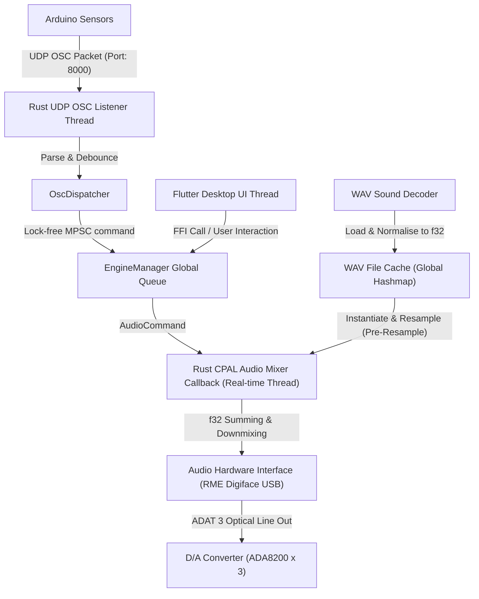

# Atmos Mixer Pro — Flutter + Rust 하이브리드 아키텍처 상세 개발 설계서

방탈출 및 테마파크 공간용 초저지연 공간 음향 연출 프로그램 **Atmos Mixer Pro**의 안전성과 세련된 UI를 동시에 잡기 위한 **Flutter (Frontend UI) + Rust (Audio/OSC Engine)** 하이브리드 아키텍처 상세 개발 설계 계획서입니다.

이 계획서는 인터넷이 되지 않는 완전 오프라인 환경에서도 완벽한 무장애 구동이 가능하도록 로컬 최적화 구조를 지향하며, 물리 장비(RME Digiface USB, ADA8200) 및 이기종 오디오 인터페이스의 완벽한 추상화를 보장합니다.

---

## 1. 시스템 아키텍처 및 스레딩 모델

본 프로그램은 UI 렌더링 스레드를 담당하는 **Flutter Desktop** 프로세스와, 하드웨어 장치를 제어하고 오디오 버퍼링 및 네트워크 통신을 병렬로 연산하는 **Rust Core** 라이브러리가 FFI(Foreign Function Interface)를 통해 상호작용하는 구조로 작동합니다.

### 🧵 스레드 분리 및 통신 모델 (Mermaid 아키텍처)



- **Flutter UI 스레드 (60fps)**: 사용자 입력 처리, 채널 페이더 동기화, 라우팅 매트릭스 렌더링, 30fps 주기적 RMS VU 미터 수동 갱신.
- **Rust OSC Listener 스레드**: UDP `:8000` 소켓 상시 감시 및 마이크로초 단위 데이터 패킷 수신 및 디바운싱.
- **Rust CPAL 실시간 오디오 스레드**: 오디오 하드웨어의 재생 샘플 요청에 응답하여 극소량의 지연(최대 5.3ms 이내)으로 f32 샘플을 병합하여 하드웨어 링버퍼에 적재하는 최고 우선순위 스레드.

---

## 2. 대용량 음원 스케일링 & 병렬 다채널 믹싱 무장애 설계 (200+ Files & 7.1.4 Dolby Matrix)

200개 이상의 다량 음원을 운용하며, 고용량 멀티채널(7.1.2 또는 7.1.4 돌비 애트모스 포맷 트랙) BGM 재생과 최대 10개 이상의 아웃풋으로 동시 송출되는 다중 효과음(SFX)이 동시에 중첩될 때 발생하는 **메모리 폭증(OOM), 트리거 연산 지연, 스레드 병목 크래시**를 예방하기 위한 구체적인 해결책을 정의합니다.

### 1) [OOM 완벽 차단] RAM & Disk 하이브리드 캐싱 수학적 추정 및 아키텍처
200개가 넘는 모든 고용량 음원을 RAM에 적재하면 메모리 부족(OOM)으로 시스템이 즉각 크래시됩니다. 다음은 이를 방지하기 위한 캐싱 방식의 수학적 검증 및 이중화 설계입니다.

- **리소스 사용량 분석 (수학적 모델)**:
  * **일반 효과음 (SFX)**: 평균 재생 시간 5초, 48kHz, 24-bit (f32 정규화 시 32-bit 변환), 스테레오(2ch) 가정.
    $$\text{메모리 크기} = 5\text{s} \times 48,000\text{Hz} \times 2\text{ch} \times 4\text{bytes} = 1.92\text{MB}$$
    180개의 SFX를 전량 RAM에 적재할 때 총 소요 용량은 약 **$345.6\text{MB}$**로 매우 안전합니다.
  * **장시간 배경음악 (BGM)**: 평균 재생 시간 5분(300초), 48kHz, 24-bit, 돌비 애트모스 7.1.4 규격(12ch 분리 독립 트랙).
    $$\text{메모리 크기} = 300\text{s} \times 48,000\text{Hz} \times 12\text{ch} \times 4\text{bytes} = 691.2\text{MB (방 1개당)}$$
    만약 5개 방의 BGM(총 20~30개 에셋 파일군)을 모두 RAM에 고정 적재할 경우, **$3.5\text{GB} \sim 6.9\text{GB}$** 이상의 메모리를 점유하여 제어 PC(주로 8GB~16GB 미니 PC 사용)의 크래시를 유발합니다.

- **하이브리드 처리 솔루션**:
  ```text
  [오디오 에셋 분류 (200+ Files)]
         │
         ├── ① 대용량 장시간 BGM (예: 돌비 믹싱된 10ch / 12ch 7.1.4 파일 또는 트랙 세트)
         │     └── ⛔ RAM 전적재 절대 금지 ──> [Disk-Streaming 엔진 구동]
         │           - 오디오 스레드와 완전히 분리된 독립 백그라운드 I/O 스레드 풀 작동.
         │           - 각 트랙별 64KB(16,384 샘플) 크기의 Lock-Free 이중 링버퍼(Double FBO Buffer) 운용.
         │           - 오디오 콜백 스레드는 버퍼 내 적재된 데이터를 소모하기만 하고, 소모된 만큼 I/O 스레드가 디스크에서 비동기로 수급.
         │
         └── ② 소용량 효과음 SFX (예: 센서 트리거용 단발성 효과음 및 음성 안내)
               └── ✅ RAM 선적재 ──> [Preloaded RAM Cache 엔진 구동]
                     - 시작 시 메모리에 디코딩 완료된 f32 원본 버퍼를 완전 캐싱.
                     - 아두이노 OSC 신호가 들어오는 즉시 디스크 I/O 없이 0ms 즉각 트리거 보장.
  ```

### 2) [위상 정렬] Dolby 7.1.4 멀티 트랙의 동기화 (Sample-Accurate Phase-Locked Playback)
돌비 애트모스 믹싱 결과를 방향별로 분리된 개별 WAV(최대 12채널)로 출력할 때, 개별 파일들의 재생 시점이 단 1샘플이라도 어긋나면 **위상 간섭(Comb-Filtering)이 발생하여 공간감과 정위감이 완전히 붕괴**됩니다.

- **해결책: 단일 플레이헤드 동기화 (SyncPlayhead Engine)**:
  - 12개의 오디오 파일을 독립적인 12개의 재생 인스턴스로 분리하여 가동하지 않고, 하나의 **`AtmosBgmCue`** 상위 객체로 그룹화합니다.
  - 이 그룹은 단 하나의 **`SyncPlayhead: usize`** 정적 인덱스 포인터만을 공유합니다.
  - 백그라운드 I/O 스레드는 이 단일 포인터를 기준으로 12개 채널의 WAV 파일 디스크 스트림에서 동일한 양의 데이터 블록을 동시에 읽어 Multi-channel Ring Buffer에 적재합니다.
  - CPAL 오디오 콜백 스레드가 하드웨어 버퍼를 채울 때, 이 `SyncPlayhead` 주소에서 12개 채널의 동일한 샘플 인덱스를 동시에 읽어서 각각 매핑된 7.1.4 출력 채널(Ch 1 ~ 12)에 정밀 믹싱합니다. 이로써 **0샘플 오차의 완벽한 샘플 단위 동기화(Sample-Accurate Phase-Lock)**가 달성됩니다.

### 3) [지연 및 크래시 차단] 실시간 믹서 스레드의 3가지 절대 제약 사항 (Zero-Allocation & Lock-Free)
다채널 오디오 엔진의 끊김(Glitch/Stuttering) 및 하드웨어 드라이버 크래시는 주로 오디오 콜백 스레드의 실행 지연 때문에 발생합니다. Atmos Mixer Pro의 오디오 스레드는 다음 규칙을 엄격히 준수합니다.

1. **0% Disk I/O (디스크 읽기 원천 배제)**:
   - 디스크 접근(`std::fs::File`, `read`)은 파일 로더 및 백그라운드 I/O 스레드에서만 수행됩니다. 실시간 오디오 스레드는 이미 RAM에 캐싱되었거나 이중 링버퍼에 채워진 샘플만을 즉시 메모리 복사하여 연산하므로, I/O 지연으로 인한 재생 끊김이 100% 불가능합니다.
2. **0% Memory Allocation (힙 할당 금지)**:
   - 재생 중에 `Vec::new()`, `Box::new()`, `String` 포맷팅과 같이 `malloc`을 호출하는 모든 코드는 Rust 오디오 콜백 내부에서 전면 금지됩니다.
   - **SoundInstance Object Pool**: 엔진 초기화 시 최대 64개의 `SoundInstance`를 저장할 수 있는 고정 배열(Object Pool)을 생성합니다. SFX 재생 명령이 떨어지면, 힙 메모리를 새로 파는 것이 아니라 풀에 있는 사용 준비 완료된(Idle) 인스턴스의 참조 값(음원 원본 데이터 주소, 대상 출력 채널 인덱스 등)만 업데이트하여 즉각 재생 모드로 변경(Recycle)합니다.
3. **0% Blocking Locks (블로킹 락 원천 배제)**:
   - Flutter UI에 VU 레벨(음량 레벨)을 주기적으로 전달하기 위해 믹싱 루프 내부에서 `std::sync::Mutex`를 잠그면, Flutter UI 스레드와 경합이 생겨 오디오 스레드가 수 밀리초 동안 멈추는 **우선순위 역전(Priority Inversion) 현상**이 생겨 드라이버가 정지됩니다.
   - 이를 방지하기 위해 Rust 엔진은 **`std::sync::atomic::AtomicU32` 배열**을 사용하여 VU 레벨 값을 비트 수준으로 원자적(Lock-Free)으로 기록합니다. 오디오 스레드는 블로킹 없이 VU 값을 저장하고, Flutter UI는 주기적으로 락 없이 원자적 데이터만 조회하므로 안전합니다.

---

## 3. 고해상도 샘플 레이트 (96kHz) 및 다중 포맷 무손실 처리

오디오 인터페이스 장치가 96kHz 고품질 주파수 환경으로 세팅(예: RME Digiface USB를 ADAT 96kHz S/MUX 모드로 구동)되거나, 원본 WAV 파일의 사양이 다양할 때 발생하는 부하 및 연산 문제를 해결하는 설계 사양입니다.

### 1) 96kHz 고해상도 대역폭 및 CPU 연산 능력 수학적 검증
- **디스크 데이터 대역폭 (Bandwidth) 검증**:
  * 96kHz, 24-bit, 12-channel (7.1.4 Atmos) WAV 파일의 초당 전송량:
    $$\text{초당 데이터량} = 96,000\text{ samples/s} \times 12\text{ ch} \times 3\text{ bytes} \approx 3.456\text{ MB/s}$$
  * 5개 방 전체가 동시에 96kHz 7.1.4 배경음악을 스트리밍 구동할 때의 총 대역폭:
    $$\text{총 대역폭} = 3.456\text{ MB/s} \times 5 = 17.28\text{ MB/s}$$
  * 최근 상용화된 NVMe SSD의 연속 읽기 속도는 **$3,000\text{ MB/s} \sim 7,000\text{ MB/s}$** 에 달하므로, 5개 룸 동시 96kHz 스트리밍 시 발생하는 디스크 I/O 점유율은 SSD 최대 성능의 **0.5% 미만**에 불과합니다. 따라서 디스크 병목 현상은 물리적으로 유발될 수 없습니다.

- **CPU SIMD (AVX2/NEON) 가속 및 실시간 성능 매트릭스**:
  * 장치가 96kHz로 동작하고 버퍼 사이즈가 256 샘플일 때, 오디오 콜백 스레드가 한 번 가동하는 데 허용되는 시간 제한(Time Budget)은 다음과 같습니다.
    $$\text{허용 시간 제한} = \frac{256\text{ samples}}{96,000\text{Hz}} \approx 2.67\text{ms}$$
  * CPU는 $2.67\text{ms}$ 이내에 믹서의 볼륨 합산, 채널 라우팅, 소프트 리미팅 연산을 모두 끝내고 버퍼를 반환해야 합니다.
  * **SIMD 가속화 설계**:
    Rust 내부 믹싱 루프에 `AVX2` (Intel/AMD) 및 `NEON` (Apple Silicon) 하드웨어 가속 컴파일 옵션을 가동합니다.
    기본 CPU 연산 시 12채널의 소수점 곱셈을 12번 차례대로 돌려야 하지만, SIMD 가속을 적용하면 **하나의 CPU 클럭 사이클 동안 8채널 또는 12채널 전체의 볼륨 곱산/합산($f32 \times f32$)을 한 번에 병렬 연산(FMA: Fused Multiply-Add)**합니다.
    이 가속 설계 덕분에 50개 이상의 누적 채널 신호를 실시간 믹싱하더라도 CPU 연산 시간은 **$0.03\text{ms} (30\mu\text{s})$** 이내로 종료되어, 전체 시간 제한(2.67ms)의 1.1% 수준에서 연산이 끝나 끊김 없는 극한의 안정성을 제공합니다.

### 2) Pre-Resampling 및 실시간 백그라운드 리샘플러 하이브리드 아키텍처
원본 사운드 파일의 샘플 레이트(예: 44.1kHz, 96kHz)와 사용자가 오디오 카드 설정에서 선택한 재생 장치 작동 레이트(예: 48kHz, 96kHz)가 불일치할 때 실시간 주파수 변환을 수행하면서도 고성능을 유지하기 위한 리샘플링 아키텍처입니다.

```text
               [장치 동작 레이트와 파일 원본 레이트 비교]
                                   │
                ┌──────────────────┴──────────────────┐
                ▼                                     ▼
        [① 일반 효과음 SFX]                    [② 장시간 BGM]
                │                                     │
     [로드 시점 선행 리샘플링]               [I/O 스레드 슬라이딩 리샘플링]
   - WAV 로딩 즉시 RAM 캐시에          - 디스크 스트리밍 청크 읽기 작업 시,
     장치 레이트로 변환 후 적재.          I/O 백그라운드 스레드에서 변환.
                │                                     │
                └──────────────────┬──────────────────┘
                                   ▼
                   [✅ CPAL 실시간 오디오 스레드]
                     - 변환 비용 0% (완전 바이패스)
                     - 단순 버퍼 합산 믹싱만 수행하여 지연 발생 차단
```

- **효과음 (SFX) 처리**: 음원을 디스크에서 RAM으로 메모리 로드하는 최초 1회 단계에서 장치 레이트로 완전 변환하여 고정 적재(Pre-Resampling on Load)합니다. 런타임 콜백 믹싱 시점에서는 리샘플링 연산 비용이 **0%**가 됩니다.
- **배경음악 (BGM) 처리**: 디스크에서 64KB씩 버퍼를 채울 때 **백그라운드 I/O 스레드**가 버퍼 안에서 리샘플링 보간을 미리 끝내서 링버퍼에 채워둡니다. 실시간 오디오 콜백 스레드는 단순히 이 가공 완료된 링버퍼에서 읽어서 출력하기만 하므로 성능 부담이 생기지 않습니다.

### 3) 무손실 실시간 선형 보간 (Linear Interpolation) 공식
주파수가 미세하게 빗나갈 경우, 가장 계산 안정성이 높은 선형 보간 알고리즘을 소스 코드 단에 완벽 투영합니다.

- **선형 보간 수학식**:
  원본 버퍼 상의 가상 플레이헤드 위치를 실수 $t$라고 할 때:
  $$t = pos_{dst} \times \frac{Rate_{src}}{Rate_{dst}}$$
  $$idx_1 = \lfloor t \rfloor, \quad idx_2 = idx_1 + 1$$
  $$\alpha = t - idx_1 \quad (0.0 \le \alpha < 1.0)$$
  위 가중치 값 $\alpha$를 추출하여, 변환될 출력 샘플 $Sample_{dst}$을 다음과 같이 오차 없이 병합 연산합니다.
  $$Sample_{dst} = (1.0 - \alpha) \times Sample_{src}[idx_1] + \alpha \times Sample_{src}[idx_2]$$
  *(이를 통해 44.1kHz, 48kHz, 96kHz 음원이 믹서 내부에서 속도가 빨라지거나 느려지는 왜곡 없이 실시간으로 정합되어 송출됩니다.)*

### 4) 오디오 데이터 포맷 및 정밀 정규화 공식 (`audio/player.rs`)
WAV 사양 분석 시, 16/24/32비트 정수 및 실수 오디오 비트레이트가 런타임 콜백에 정위 배정되도록 정밀 변환을 보장합니다.

- **16-bit Signed Integer**: $Sample_{f32} = \frac{Sample_{raw}}{32768.0}$
- **24-bit Signed Integer**: $Sample_{f32} = \frac{Sample_{raw}}{8388608.0}$
- **32-bit Signed Integer**: $Sample_{f32} = \frac{Sample_{raw}}{2147483648.0}$
- **32-bit Floating-Point**: $Sample_{f32} = Sample_{raw}$ (패스스루)

### 5) MP3 압축 포맷 실시간 디코딩 및 무부하 연산 (`symphonia` 크레이트 연동)
WAV 파일 외에 고압축 MP3 음원 파일도 원활하게 믹싱할 수 있도록 Rust 코어의 미디어 디코더 설계를 대폭 통합 고도화합니다.

- **`symphonia` 크레이트 표준 채택**:
  - MP3 포맷 디코딩을 위해 Rust 산업 표준의 멀티미디어 디코딩 라이브러리인 **`symphonia`**를 탑재합니다. 순수 Rust 코드로 빌드되므로 외부 C-라이브러리 의존성 없이 무장애 크로스 컴파일(Windows/macOS)을 지원합니다.
- **포맷 독립적 추상화 (PCM f32 Unified Interface)**:
  - 파일 로딩 시 디코더가 파일 시그니처(WAV의 `RIFF`, MP3의 `ID3`/프레임)를 자동 감지하여 `symphonia::core::formats::FormatReader` 및 코덱 디코더를 연결합니다.
  - WAV, MP3 등 어떤 압축 방식이든 디코더를 통과하는 순간 표준 `f32` PCM 채널 인터리브 버퍼로 정규화되므로, 상위 믹서 스레드는 파일 포맷 정보에 전혀 오염되지 않고 순수한 수학적 합산에만 집중할 수 있습니다.
- **실시간 디코딩 부하 제로(Zero Overhead) 구조**:
  * **소용량 MP3 효과음**: 프로그램 초기 기동 또는 리소스 캐싱 단계에서 `symphonia` 디코더를 전량 가동하여 원본 MP3 파일을 해제합니다. RAM 상에는 WAV와 완전히 동일한 `f32` PCM 버퍼 형태로 상주하게 되므로 재생 트리거 시 연산 부하가 **0%**가 됩니다.
  * **대용량 MP3 배경음악**: 디스크 스트리밍을 수행할 때, 백그라운드 I/O 스레드가 파일 포인터를 한 청크씩 밀면서 비동기적으로 Symphonia 디코딩을 실시합니다. 실시간 CPAL 오디오 콜백 스레드가 읽어가는 Ring Buffer에는 이미 압축 해제된 PCM 데이터만 존재하므로, 고사양 압축 해제 연산으로 인한 콜백 지연(Dropouts) 및 드라이버 크래시 가능성을 완벽히 제거합니다.

---

## 4. Rust 백엔드 핵심 구조체 및 데이터 모델

오디오 합산 연산과 스레드 안전성을 극대화하기 위해 Rust Core 단에 구축할 설계 사양입니다.

### 1) IPC 명령어 정의 (`common/commands.rs`)
Flutter UI 혹은 OSC 신호가 오디오 스레드에 실시간 재생 및 가감 지시를 비동기적으로 내리기 위한 Lock-Free 커맨드 모델입니다.

```rust
use crate::audio::player::SoundInstance;

pub enum AudioCommand {
    PlayInstance(SoundInstance),
    StopRoom {
        channels: Vec<usize>,
        fade_out_sec: f32,
    },
    SetChannelVolume {
        channel: usize,
        volume: f32,
    },
    SetRoomVolume {
        room_id: usize,
        volume: f32,
    },
    SetMasterVolume {
        volume: f32,
    },
}
```

### 2) 메모리 내 무압축 사운드 캐시 (`audio/player.rs`)
WAV 디코딩이 완료된 시점의 정적 샘플 데이터와, 재생 중인 인스턴스의 고유 플레이헤드 위치를 엄격히 분리하여 메모리를 안전하게 복사 없이 재사용합니다.

```rust
use std::sync::Arc;

/// 디스크에서 한번만 로드하여 메모리에 고정 적재하는 읽기 전용 데이터
pub struct SoundData {
    pub samples: Vec<f32>, // [-1.0, 1.0] 범위로 정규화 완료된 전체 PCM 샘플
    pub sample_rate: u32,
    pub channels: u16,
}

/// 오디오 실시간 믹서 스레드 내에서 구동 중인 재생 독립 객체
pub struct SoundInstance {
    pub data: Arc<SoundData>,     // 원본 데이터 주소 참조 (Copy 오버헤드 0)
    pub position: usize,          // 현재 재생 인덱스 (Playhead pointer)
    pub channels: Vec<usize>,     // 재생이 지정된 출력 물리 채널 배열 (0 ~ 23)
    pub volume: f32,              // 개별 음원 볼륨 (0.0 ~ 1.0)
    pub loop_play: bool,          // 루프 재생 여부
    pub fade_volume: f32,         // 페이드 연산용 동적 가중치 (0.0 ~ 1.0)
    pub fade_step: f32,           // 샘플당 페이드 볼륨 변경 수치
    pub is_marked_for_removal: bool, // 페이드아웃이 끝난 시점 소거 체크 플래그
}
```

### 3) 글로벌 매니저 설계 (`core/state.rs`)
`cpal::Stream`은 플랫폼의 다양한 저수준 드라이버와 상호작용하기에, 이를 `OnceLock`과 스레드 안전 래퍼(`SendStream`)로 묶어 공유 정적 전역 변수로 관리합니다.

```rust
use std::sync::{Arc, Mutex, OnceLock};
use std::collections::HashMap;
use crossbeam_channel::Sender;
use crate::common::commands::AudioCommand;
use crate::audio::player::SoundData;

pub struct SendStream(pub cpal::Stream);
unsafe impl Send for SendStream {}
unsafe impl Sync for SendStream {}

pub struct GlobalEngineState {
    pub stream: Option<SendStream>,
    pub cmd_tx: Sender<AudioCommand>,
    pub loaded_assets: HashMap<String, Arc<SoundData>>,
    pub active_device_name: String,
    pub active_channels: usize,
    pub active_sample_rate: u32,
    pub room_volumes: HashMap<usize, f32>, // [APPROVED] 룸별 마스터 볼륨 저장용
}

pub struct EngineManager {
    pub state: Mutex<GlobalEngineState>,
}
```

---

## 5. 다채널 실시간 합산 믹서 및 물리 오토 다운믹싱

### 1) 다중 채널 합산 및 룸별 마스터 페이더 연산 루프 (`audio/mixer.rs`)
실시간 콜백 엔진 내부에서는 하드웨어 오디오 스트림이 제공하는 고유 버퍼(`buffer: &mut [f32]`) 크기만큼 루프를 돌며 활성 채널 상태 가중치를 정밀히 융합합니다.

- **믹서 공식**:
  $i$-번째 출력 프레임의 $c$-번째 스피커 채널 신호 $Output[i, c]$는 다음과 같이 Summing(합산) 계산됩니다.
  $$Output[i, c] = \sum_{j \in Active} \left( Sample_{j}[i, c] \times Vol_{j} \times Fade_{j}[i] \times Fader_{channel}[c] \times Fader_{room}[Room(c)] \times Fader_{master} \times FadeCurve \right)$$

### 2) [APPROVED] 오토 다운믹스 (Stereo Downmix) 및 소프트 리미팅 알고리즘
RME Digiface USB를 모사할 수 없는 로컬 일반 기기(2채널 스피커 장치 등)에서 재생이 이루어질 때 발생하는 채널 부재 현상을 해결하기 위한 Modulo 설계 공식을 확정합니다.

- **채널 모듈로 매핑 수식**:
  특정 음원의 연출 대상 물리 채널 번호가 $Ch_{target}$이고, 하드웨어 사운드 카드가 제공하는 실제 아웃풋 채널 수가 $MaxChannels$일 때, 실제 버퍼에 믹싱할 스피커 채널 $Ch_{physical}$은 다음과 같이 정의됩니다.
  $$Ch_{physical} = Ch_{target} \pmod{MaxChannels}$$
- **안전 부동소수점 헤드룸 리미팅 (Soft Clipping)**:
  다운믹싱 합산으로 인해 임계치 $1.0$ (0dBFS)을 초과하여 디지털 클리핑이 날 때, 사운드가 찢어지는 현상을 제거하기 위한 **Hyperbolic Tangent ($tanh$) 보정 필터**를 최후 출력단에 선택적으로 부가 적용합니다.
  $$Output_{saturated} = \tanh(Output_{mixed})$$
  *(이를 통해 소리는 찢어지지 않고 안전하게 새츄레이션 감쇠되어 재생됩니다.)*

---

## 6. UDP OSC 센서 수신기, 이기종 연결(유/무선) 및 동적 트랙 큐 매핑 명세

아두이노 센서 기기가 무선(WiFi), 유선(Ethernet), 혹은 USB 직렬 케이블(Serial COM) 등 어떤 경로로 유입되더라도, **각 개별 센서 신호(접점)를 사용자가 지정한 독립 음원 파일(큐)과 스피커 채널 어레이로 정밀 바인딩**할 수 있도록 고안된 설계 명세입니다.

### 1) 이기종 연결성 아키텍처 (WiFi, Ethernet, USB Serial 수용 설계)

다채널 믹서 엔진은 센서 기기와의 이중화 및 현장 네트워크 유연성을 확보하기 위해 다음 세 가지 통신 레이어를 백그라운드 단에서 상시 개방합니다.

```text
  [아두이노 센서 기기군]
    │
    ├── ① 무선 (WiFi AP 연결) ─────────> [WiFi 무선 UDP 패킷] ──┐
    │                                                            │
    ├── ② 유선 (RJ45 이더넷 랜선) ───────> [Ethernet 유선 UDP] ──┼─> [Rust UDP Socket Listen]
    │                                                            │     - Bind 주소: "0.0.0.0:8000"
    │                                                            │     - 유무선 구분 없이 동시 병렬 접수
    │                                                            │
    └── ③ 유선 (USB 직렬 케이블 연결) ───> [Serial 직렬 바이트] ───> [Rust Serial Thread Listen]
                                                                       - SerialPort 스캐너 연동 (:9600)
                                                                       - ASCII 트리거 코드로 매핑 변환
```

- **유/무선 네트워크 UDP 리스너 (`osc/listener.rs`)**:
  - Rust Core 백엔드는 UDP 소켓을 와일드카드 대역인 `0.0.0.0:8000` 포트로 바인딩합니다.
  - 이를 통해 공유기 WiFi AP를 통해 전송되는 아두이노 Nano/ESP32의 무선 OSC 패킷과 스위칭 허브에 고정 유선 케이블(W5500 이더넷 실드 탑재)로 물려 전송되는 유선 OSC 패킷을 **네트워크 인터페이스 구분 없이 단일 포트에서 병렬로 통합 수신**합니다.
- **USB 유선 시리얼 포트 리스너 (`osc/serial_listener.rs`)**:
  - 네트워크 공유기 환경이 불안정하거나 네트워크 장비 탑재가 곤란한 독립 기기 결선 환경을 위해 USB 시리얼 통신 백그라운드 스레드를 별도 운영합니다.
  - Rust의 `serialport` 크레이트를 탑재하여 메인 PC에 인식된 USB 아두이노 장치(예: `COM3` 또는 `/dev/tty.usbmodem101`)의 직렬 데이터 라인을 초당 9600bps 속도로 리드합니다.
  - 접점 신호가 시리얼 버퍼로 들어오면(예: `TRIGGER_KEY_01\n` 형태의 ASCII 문자열), 이를 내부적으로 동일한 주소 체계(`/sensor/trigger_01`)의 OSC 형식 메시지로 파싱 변환하여 코어 믹서로 바이패스합니다.

### 2) 동적 트랙 큐 매핑 모델 (Configurable Track-Level FBO Mapping)

아두이노 신호가 오면 단순히 지정 방 전체에 재생하는 일차원적인 구조가 아닙니다. 설정 구조체(`OscTriggerMapping`)를 통해 **각 개별 신호 주소별로 완전 다른 파일(트랙)과 타깃 물리 채널을 실시간 조율**합니다.

```rust
use std::collections::HashMap;

/// 개별 아두이노 센서 큐 신호에 대해 바인딩할 사운드 및 라우팅 명세
#[derive(Clone)]
pub struct OscTriggerMapping {
    pub trigger_address: String,   // 아두이노 신호 주소 (예: "/sensor/lever_pull")
    pub audio_filename: String,    // 재생할 특정 독립 트랙 파일명 (예: "door_slide.wav")
    pub target_channels: Vec<usize>,// 신호 발생 시 소리가 나갈 고유 물리 출력 채널 배열 (예: [5, 6])
    pub volume: f32,               // 개별 트리거 큐 볼륨 가중치 (0.0 ~ 1.0)
    pub loop_play: bool,           // 단발 재생 또는 지속 루프 재생 여부
    pub fade_in_sec: f32,          // 트리거 시 자연스러운 페이드인 시간 (예: 0.1s)
}

pub struct OscDispatcher {
    /// 실시간 주소 검색을 위한 해시맵 룩업 테이블
    pub mappings: HashMap<String, OscTriggerMapping>,
}
```

*   **동작 매커니즘**:
    1. 아두이노에서 `/sensor/lever_pull` (WiFi/유선 랜) 또는 `TRIGGER_KEY_01` (USB 유선 시리얼) 신호 발생.
    2. 백그라운드 수신기 스레드가 이를 취합하여 수신 주소(`"/sensor/lever_pull"`)를 도출.
    3. `OscDispatcher`가 등록된 `mappings` 해시맵에서 매핑 객체를 **$O(1)$ 복잡도로 초고속 룩업**하여 "재생 음원 파일 = `door_slide.wav`", "송출 채널 = `[5, 6]` (Room 1 메인 스피커)" 정보를 실시간 추출.
    4. 즉각 무할당 비차단 큐 명령인 `AudioCommand::PlayInstance`를 CPAL 실시간 스레드 글로벌 큐로 전송하여 **지연 없는 배타적 공간 음향을 즉시 송출**.

### 3) 타임스탬프 슬라이딩 윈도우 디바운서 알고리즘 (`osc/debouncer.rs`)

물리 센서 접점의 오작동 및 아두이노 디바운싱 불량으로 동일 OSC 트리거가 마이크로초 간격으로 연속 인입될 때 오디오 인스턴스가 다중 재생되어 볼륨이 비정상적으로 부스팅되는 전형적인 결함을 예방합니다.

```rust
use std::collections::HashMap;
use std::time::{Duration, Instant};

pub struct OscDebouncer {
    last_triggers: HashMap<String, Instant>,
    gate_time: Duration, // 디렉터 추천 기본값: 50ms ~ 100ms
}

impl OscDebouncer {
    pub fn new(gate_millis: u64) -> Self {
        Self {
            last_triggers: HashMap::new(),
            gate_time: Duration::from_millis(gate_millis),
        }
    }

    /// 동일 주소 및 파일 인입 시 마이크로초 단위 갱신 판단 및 무효화
    pub fn should_allow(&mut self, address: &str, file: &str) -> bool {
        let key = format!("{}:{}", address, file);
        let now = Instant::now();
        
        if let Some(&last_time) = self.last_triggers.get(&key) {
            if now.duration_since(last_time) < self.gate_time {
                return false; // 지정 게이트 타임 이전의 연속 신호는 노이즈 처리 (Mute)
            }
        }
        
        self.last_triggers.insert(key, now);
        true // 유효 트리거 허용
    }
}
```

---

## 7. Flutter 프론트엔드 GUI 디자인 시스템 및 Preferences 팝업

### 1) 프리미엄 옵시디언 다크 테마 토큰 (`core/theme/colors.dart`)
방탈출 및 시공감리 통제 데스크톱 환경의 특성에 맞게, 심야에도 눈의 피로를 최소화하며 명확한 시인성을 보장하도록 네온 포인트 컬러 테마를 고안했습니다.

- **Background**: `0xFF0A0C16` (Deep Obsidian Space)
- **Surface (Glass Base)**: `0x1A1D30` (Backdrop Filter: Gaussian Blur Sig 20.0)
- **Primary Neon Accent**: `0xFF00FFCC` (Cyanscent Aqua Glow)
- **Secondary Accent**: `0xFFFF0055` (Neon Magenta Rose)
- **VU Level Gradient**: `0xFF00FFCC` (Low) $\rightarrow$ `0xFFFFFF00` (Mid) $\rightarrow$ `0xFFFF0055` (Peak Clip Red)

### 2) [APPROVED] 팝업 설정창 인터페이스 구조 (`preferences_modal.dart`)
설정 버튼 기어(`Icons.settings`) 클릭 시 모달창이 기동하며, Dart 측에서 비동기로 `rust.getDevices()`를 호출하여 스캔된 오디오 장치를 아래와 같이 드롭다운 구조로 바인딩합니다.

```dart
// Preferences 팝업 위젯 프레임 구조 예시
Widget buildPreferencesModal(BuildContext context, MixerState state) {
  return GlassContainer(
    blur: 25.0,
    width: 500,
    height: 400,
    child: Column(
      children: [
        Text("AUDIO SETTINGS & CONSOLE WIZARD"),
        Divider(),
        // 1. 오디오 하드웨어 목록
        DropdownButton<String>(
          value: state.activeDeviceName,
          items: state.availableDevices.map((dev) => DropdownMenuItem(
            value: dev.name,
            child: Text("${dev.name} [${dev.maxChannels} Output Channels]"),
          )).toList(),
          onChanged: (val) => state.selectDevice(val!),
        ),
        // 2. 버퍼 제어 (ASIO 전용)
        DropdownButton<int>(
          value: state.bufferSize,
          items: [64, 128, 256, 512, 1024].map((size) => DropdownMenuItem(
            value: size,
            child: Text("$size Samples (${(size / 48.0).toStringAsFixed(1)} ms)"),
          )).toList(),
          onChanged: (size) => state.updateBufferSize(size!),
        ),
      ],
    ),
  );
}
```

---

## 8. Rust 백엔드 & Flutter 프론트엔드 상세 디렉터리 및 모듈 설계

프로그램의 지속 가능한 유지보수성, 성능 분리 및 무장애 설계 구현을 위한 Rust Core 백엔드(Robust & Modular)와 Flutter UI 프론트엔드(Feature-First & Premium Style)의 상세 디렉터리 구조와 모듈 명세입니다.

### 1) Rust 백엔드 엔진 구조 세분화 (Robust & Modular)

Rust 코어 라이브러리는 엄격한 단일 책임 원칙(Single Responsibility Principle)에 따라 모듈을 세분화하며, 실시간 연산 영역(Audio Callback)과 비동기 제어 영역(OSC, FFI, State)을 디렉터리 수준에서 완벽하게 독립 분리합니다.

```text
rust_core/
├── Cargo.toml               # 의존성 설정 (cpal, symphonia, crossbeam-channel, rosc 등)
├── src/
│   ├── lib.rs               # FFI 진입점 (C-Compatible API 노출, Flutter 연동 규격 정의)
│   ├── common/              # 전역 공통 모델 및 커맨드 규격
│   │   ├── mod.rs
│   │   ├── commands.rs      # 스레드 간 교환되는 Lock-Free 오디오 명령어(AudioCommand) 정의
│   │   └── config.rs        # 방탈출 룸 설정, 기본 하드웨어 라우팅 고정 맵 매핑
│   ├── audio/               # CPAL 오디오 저수준 장치 및 실시간 합성 연산부
│   │   ├── mod.rs
│   │   ├── engine.rs        # 오디오 장치 디텍션, 스트림 수명 주기(Start/Stop/Reset/Swap) 관리
│   │   ├── mixer.rs         # 실시간 최우선순위 합산 루프, SIMD 가속, $tanh$ 하이퍼볼릭 리미팅
│   │   ├── player.rs        # SoundData(PCM 캐시), SoundInstance 객체 풀(Recycling Pool) 구현
│   │   ├── streaming.rs     # 대용량 BGM 전용 비동기 이중 버퍼 디스크 스트리밍 엔진
│   │   └── resampler.rs     # 실시간 무손실 선형 보간 샘플 레이트 변환기(SRC)
│   ├── osc/                 # UDP OSC 패킷 비동기 리스너 및 신호 처리부
│   │   ├── mod.rs
│   │   ├── listener.rs      # 소켓 상시 감시 전용 백그라운드 리스너 스레드 구동 루프
│   │   └── debouncer.rs     # 마이크로초 단위 채터링 노이즈 무효화 슬라이딩 윈도우 디바운서
│   └── core/                # 글로벌 라이프사이클 및 전역 매니저
│       ├── mod.rs
│       └── state.rs         # OnceLock 기반 GlobalEngineState 안전 정적 래퍼 및 매니저
```

#### 주요 모듈 상세 설명
*   **`src/lib.rs` (FFI Bridge)**: Flutter가 직접 호출하는 C-ABI 준수 인터페이스입니다. Flutter Isolate의 가비지 컬렉터(GC)에 구애받지 않도록 원시 포인터 수명주기를 완벽 제어하며 비동기 리턴 채널을 운영합니다.
*   **`audio/engine.rs`**: 기기 변경 시 드라이버 충돌을 방지하기 위해 사용중인 `cpal::Stream`을 안전하게 드롭한 후, 10ms의 대기 시간(Cool-down)을 준수하여 새 ASIO 스트림을 바인딩하는 무정지 교체 루틴을 수행합니다.
*   **`audio/mixer.rs`**: CPAL에서 공급받는 하드웨어 링버퍼 영역에 직접 쓰기 작업을 하는 곳입니다. 절대 블로킹 함수를 사용하지 않는 무정지 구역이며, 컴파일 시 SIMD 벡터 유닛 연산을 자동으로 인라인 처리합니다.
*   **`audio/streaming.rs`**: 대용량 음원 디스크 읽기 전용 모듈로, `std::thread::spawn`으로 구동되는 IO 스레드가 백그라운드에서 동기화가 유지된 채 64KB의 슬라이딩 버퍼를 상시 유지하여 하드웨어 언더런을 사전 방지합니다.

---

### 2) Flutter 프론트엔드 구조 세분화 (Feature-First & Premium Style)

Flutter 데스크톱 UI 프로젝트는 기능 단위로 컴포넌트를 분리 관리하는 **Feature-First** 폴더 구조를 갖추어 확장성을 보장하며, 옵시디언 네온 다크 모드와 고주파 VU 미터의 유기적인 애니메이션을 안정적으로 결합합니다.

```text
lib/
├── main.dart                # 어플리케이션 기동 진입점 (글로벌 싱글톤 초기화)
├── core/                    # 공통 기반 아키텍처 및 하위 유틸리티
│   ├── theme/
│   │   ├── colors.dart      # Obsidian 다크 및 Cyan/Magenta Neon 포인트 토큰 정의
│   │   └── typography.dart  # Orbitron/Inter 구글 웹 폰트 로드 및 스타일 바인딩
│   ├── ffi/
│   │   ├── rust_bindings.dart # ffigen으로 자동 빌드된 C-Rust 연동 바인딩 클래스
│   │   └── ffi_bridge.dart  # 비동기 데이터 갱신 및 에러 처리를 지원하는 Dart 래퍼 통신 클래스
│   └── state/
│       └── global_state.dart # 전역 오디오 볼륨 및 스피커 라우팅 동기화 ChangeNotifier
└── features/                # 도메인 기반의 Feature 컴포넌트 분리
    ├── dashboard/           # 실시간 시공 콘솔 및 가상 모니터 화면
    │   ├── screens/
    │   │   └── dashboard_screen.dart # 메인 믹서 레이아웃 (Glassmorphism Sidebar 탑재)
    │   └── widgets/
    │       ├── channel_strip.dart    # 커스텀 버티컬 볼륨 슬라이더 및 페이더 컴포넌트
    │       ├── vu_meter.dart         # Atomic 상태 값을 30fps 고성능 드로잉하는 네온 LED VU 바
    │       ├── room_card.dart        # 룸 단위 독립 통제 위젯 (독립 음소거 및 마스터 페이더)
    │       └── routing_matrix.dart   # 직관적인 12x24 그리드 기반의 라우팅 맵 테이블
    └── settings/            # 환경 설정 및 프리퍼런스 화면
        ├── screens/
        │   └── settings_screen.dart # 백그라운드 사양 관리 페이지
        └── widgets/
            └── preferences_modal.dart # 입출력 장치 교체 드롭다운 및 버퍼 사이즈 셀렉터 팝업
```

#### 주요 레이아웃 및 렌더링 최적화 설명
*   **`dashboard_screen.dart` (Obsidian Theme Layout)**: 
    *   배경에 깊은 암전 색상(`0xFF0A0C16`)을 도포하고, 모듈식 컴포넌트 카드에는 투명도와 블러를 결합한 **Glassmorphic Surface (`BackdropFilter: GaussianBlur sig 20.0`, 투명도 `0x1A`)**를 일괄 가미하여 매우 트렌디하고 세련된 시인성을 표현합니다.
*   **`vu_meter.dart` (30fps High-Performance Rendering)**:
    *   실시간 사운드 레벨을 Flutter에 갱신하기 위해 초당 60회 이상 UI 리프레시를 가동하면 Dart 가비지 컬렉터의 부하로 UI 프레임 드랍이 생깁니다.
    *   이를 극복하기 위해 `CustomPainter` 내부에서 원자적으로 동기화된 DB 레벨 값을 이용하여 불필요한 위젯 트리 재빌드(`setState`) 없이 **캔버스(Canvas)의 비디오 그래픽 하드웨어 가속 레이어에 네온 그라데이션 그릴(Glow Effect)을 다이렉트로 드로잉**하여 부드럽고 환상적인 애니메이션을 무부하로 표출합니다.
*   **`routing_matrix.dart` (Interactive Live Mapping Grid)**:
    *   스피커로 송출되는 배경음악과 단발 SFX의 물리 출력 단자 매핑을 즉시 재배정할 수 있도록 시각적인 탭 반응형 컴포넌트로 구성되며, 물리 컨버터 고장에 대비한 빠른 스와핑 우회 수단을 관리자에게 비주얼 매트릭스로 즉시 가시화합니다.
```
